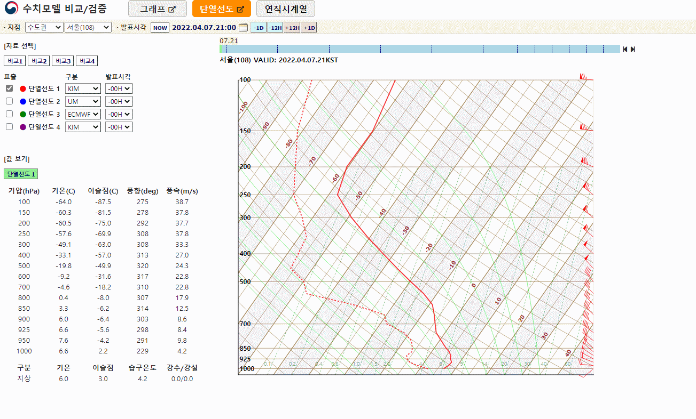
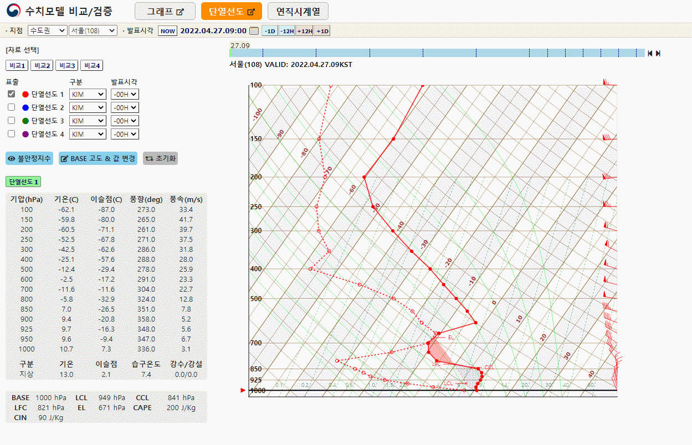
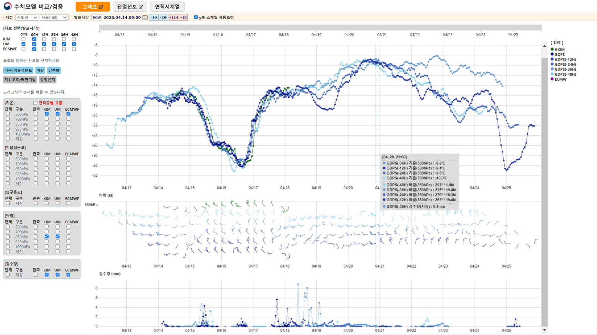

# nwp_stn
**Skew-T Diagram Analysis Tool**
- View Skew-T Diagram and can overlay multiple Diagrams
- Support Zoom/Drag
- Provide Dynamic Interaction (Modifying Temperature/Moisture Values)

**Multi-variables Time-series Graph Viewer**
- View Multi-variables (Selectable) Time-series Graphs
- Support Zoom/Drag

